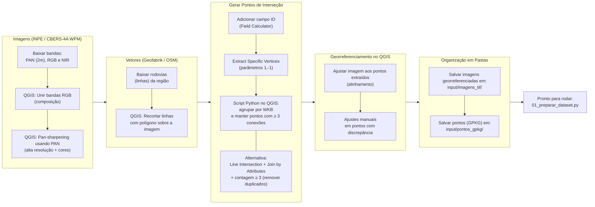
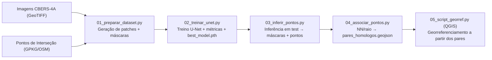

# 🚦 Detecção de Interseções de Rodovias com U-Net (CBERS-4A)

[](https://www.python.org/downloads/)
[](https://pytorch.org/)
[](LICENSE)
[](#)
[](https://qgis.org/)

Pipeline completo para **detecção e georreferenciamento de interseções rodoviárias** a partir de imagens CBERS-4A.  
Usa **U-Net (CNN)** para segmentação binária das interseções, extrai pontos e os **associa** a uma camada de referência (ex.: OSM), permitindo **georreferenciamento no QGIS**.

---

## 🧭 Visão Geral do Pipeline

### 0. 🧹 Limpeza/filtragem de interseções (QGIS)

Antes de qualquer coisa, limpe os falsos positivos dos pontos de interseção (ex.: *Line Intersections*) com o **Script 00** (algoritmo do QGIS). Ele remove quebras de linha colineares/mesma via, sinaliza ângulos obtusos e pode **quebrar** as linhas nas interseções válidas.

> Detalhes e uso: ver seção **“00_clean_intersec.py (QGIS)”** mais abaixo.

### 1. Aquisição e Preparo dos Dados

O diagrama abaixo mostra o fluxo de aquisição das imagens CBERS-4A e dos vetores OSM, passando pelo pré-processamento no QGIS até a organização final em pastas.



### 2. Execução do Pipeline

Depois dos dados preparados, o pipeline segue com os scripts de treinamento, inferência, associação e georreferenciamento, conforme o diagrama abaixo:



---

## 📂 Estrutura do Projeto

Apenas as pastas **components** e **input** são necessárias e com os arquivos já colocados. As demais vão sendo geradas conforme os scripts vão sendo executados

```
┌── 00_clean_intersec.py # (QGIS) Limpa interseções, flags e (opção) quebrar linhas
├── 01_preparar_dataset.py # Script para preparar o dataset
├── 02_treinar_unet.py # Script de treinamento da U-Net
├── 03_inferir_pontos.py # Script para inferência e geração de pontos
├── 04_associar_pontos.py # Script para associar pontos detectados com OSM
├── 05_plugin_georref.py # Plugin QGIS para georreferenciamento
│
├── components/ # Módulos reutilizáveis
│ ├── dataset.py # Classe RoadIntersectionDataset (carregamento e preparação do dataset)
│ ├── unet.py # Arquitetura da U-Net
│ ├── utils.py # Funções utilitárias (salvar/carregar checkpoints, etc.)
│ ├── losses.py # Funções de perda (BCE, Focal Loss, etc.)
│ └── metrics.py # Métricas de avaliação (IoU, precisão, recall, F1)
│
├── requirements.txt # Dependências do projeto
├── README.md # Este guia/documentação
│
├── checkpoints/ # Pesos salvos durante o treinamento (.pth)
│
├── dataset_separated/ # Dataset final dividido em subconjuntos
│ ├── train/
│ │ ├── images/ # Imagens de treino
│ │ └── masks/ # Máscaras de treino
│ ├── val/
│ │ ├── images/ # Imagens de validação
│ │ └── masks/ # Máscaras de validação
│ ├── test/
│   ├── images/ # Imagens de teste
│   └── masks/ # Máscaras de teste
│
├── dataset_patches/ # Patches gerados a partir das imagens originais
│ ├── images/ # Pedaços (patches) das imagens
│ └── masks/ # Pedaços (patches) das máscaras
│
├── input/ # Pasta para arquivos de entrada para preparo do dataset
│ ├── imagens_tif/ # Imagens de satélite CBERS-4A georreferenciadas
│ └── pontos_gpkg/ # Arquivos .gpkg com pontos de cruzamento devidamente ajustados
│
├── output/ # Resultados sobre teste (máscaras binárias inferidas em GTiff, pontos inferidos e os homólogos em GeoJSON)
│ └── mascaras_patches/ # Imagens das máscaras inferidas
│
├── main_input/ # Pasta para arquivos de entrada para rodar o script principal
│ ├── imagens_tif/ # Imagens de satélite CBERS-4A
│ └── pontos_gpkg/ # Arquivos .gpkg com pontos de cruzamento
│
├── temp_patches/ # Pasta para os arquivos temporários
│
├── main_output/ # Resultados sobre o main_input (pontos homólogos em GeoJSON para aplicar no georreferenciador do QGIS)
│ └── mascaras_patches/ # Imagens das máscaras inferidas
│
└── README.md
```

---

## ⚙️ Instalação

Crie um ambiente e instale dependências:

```bash
python -m venv .venv
# Windows PowerShell
.venv\Scripts\Activate.ps1
# Linux/Mac
# source .venv/bin/activate

pip install -r requirements.txt
```

> GPU (exemplo CUDA 12.1):
```bash
pip install torch==2.8.0 torchvision==0.23.0 --index-url https://download.pytorch.org/whl/cu121
```

---

## 🗂️ Aquisição e Preparo dos Dados

Antes de iniciar o pipeline (🚀 Como Usar), é necessário preparar o **dataset** que servirá de base para o treinamento e validação da rede.

### 🔹 Imagens de Satélite (CBERS-4A — Câmera WPM)
- As imagens foram obtidas no **site do INPE**, câmera **WPM**, que fornece:
  - Banda PAN (panchromática) — resolução espacial de 2 m  
  - Bandas espectrais RGB + NIR — em arquivos separados  
- Com o **QGIS**:
  1. **Unimos as bandas RGB** em uma única composição colorida.  
  2. Fizemos o **pan-sharpening** usando a banda PAN para aumentar a resolução espacial, obtendo assim uma imagem de **alta resolução colorida**.  

### 🔹 Vetores de Rodovias (OpenStreetMap)
- Obtidos no site **Geofabrik**, recortes do OSM das regiões do Brasil.  
- No QGIS:
  1. Fizemos um **recorte dos vetores** (linhas) usando um polígono temporário desenhado sobre a imagem CBERS-4A — garantindo que apenas rodovias dentro da área da imagem fossem mantidas.  
  2. Esse recorte reduz a complexidade e **facilita o geoprocessamento**.  

### caso não queira rodar o script `00_clean_intersec.py` ou ele esteja com problemas, pode seguir a solução abaixo
### 🔹 Conversão de Linhas em Pontos de Interseção
Para identificar os **cruzamentos rodoviários**:

1. No QGIS:  
   - Usar o **Field Calculator** e criar um campo `id` para cada feição (linha).  
   - Executar **Extract Specific Vertices** com parâmetros `1,-1` para obter pontos iniciais e finais de cada linha.  

2. No Python (QGIS Python Console ou script), rodar:

   ```python
   from collections import defaultdict

   endPointDict = defaultdict(set)
   for feat in pointLayer.getFeatures():
       geom = feat.geometry()
       geomWkb = geom.asWkb()
       endPointDict[geomWkb].add(feat["featid"])

   outputPointList = []
   for geomKey, idSet in endPointDict.items():
       if len(idSet) < 3:
           continue
       newGeom = QgsGeometry()
       newGeom.fromWkb(geomKey)
       outputPointList.append(newGeom)
   ```

   Esse código **mantém apenas os pontos onde há 3 ou mais conexões de linhas**, ou seja, os **cruzamentos rodoviários reais**.  

3. Caso queira usar **Line Intersection** no QGIS para encontrar interseções:
   - Adicionar um campo `id` via Field Calculator.  
   - Usar **Join by Attributes**.  
   - Contar quantos registros cada ponto possui.  
   - Filtrar apenas pontos com **3 ou mais ocorrências**, eliminando duplicados.  

### 🔹 Georreferenciamento Final
- Usando o **QGIS**, ajustar o georreferenciamento para alinhar a imagem CBERS-4A aos pontos extraídos:  
  - Ajustar a imagem para que os cruzamentos estejam o mais próximo possível dos pontos gerados.  
  - **Mover manualmente** pontos em locais de maior discrepância.  

Com isso, temos:
- Imagens CBERS-4A georreferenciadas e preparadas.  
- Camada de pontos representando cruzamentos rodoviários.  

---

## 📁 Organização Final dos Dados de Input

Os arquivos de input devem ser organizados assim:

```
input/
├── imagens_tif/      # Imagens de satélite CBERS-4A georreferenciadas
└── pontos_gpkg/      # Camadas .gpkg com pontos de cruzamento
```

Essas pastas serão utilizadas diretamente no script **01_preparar_dataset.py** para geração dos patches de treino, validação e teste.

---

## 🚀 Como Usar

Aqui está o fluxo completo do pipeline, com a explicação detalhada de cada script:

### 0. 🧹 Limpar interseções (QGIS) — `00_clean_intersec.py`

**O que faz:**  
- Filtra falsos positivos dos pontos de *Line Intersections* (p.ex., quebras colineares/mesma via).  
- Gera **flags** por ponto:
  - `n_lines`: quantas linhas tocam o ponto;
  - `ang_deg`: ângulo entre duas linhas (quando aplicável);
  - `is_obtuse`: 1 se ângulo ≥ `ANG_FLAG_DEG` (padrão 90°);
  - `same_way`: 1 se as duas linhas parecem ser a mesma via (heurística por `osm_id` ou `name/ref`).
- **Opcional:** quebrar as linhas exatamente nos pontos válidos.

**Parâmetros principais:**
- `TOLERANCE (m)`: tolerância espacial (padrão 0.75 m).
- `ANG_TOL (graus)`: tolerância para colinearidade (padrão 12°).
- `ANG_FLAG_DEG (graus)`: ângulo para marcar `is_obtuse` (padrão 90°).
- `DROP_SAME_WAY (bool)`: descartar pontos que são continuidade da mesma via (padrão `True`).
- `DO_SPLIT (bool)`: quebrar as linhas nos pontos válidos (padrão `True`).

**Entradas:**  
- `INPUT_POINTS`: pontos de *Line Intersections* (ou vértices extremos).  
- `INPUT_LINES`: linhas OSM já filtradas/recortadas.

**Saídas:**  
- `OUTPUT_POINTS`: **pontos limpos** com flags (use este GPKG no resto do pipeline).  
- `OUTPUT_LINES`: linhas quebradas (se `DO_SPLIT=True`) ou cópia.

#### ➕ Como instalar o Script 00 no QGIS (Toolbox do Processing)

**Opção A — Add Script (mais rápido)**  
1. Abra o **QGIS** → **Processing Toolbox**.  
2. Clique com o botão direito em **Scripts** → **Add Script…**.  
3. Selecione o arquivo `00_clean_intersec.py`.  
4. O algoritmo aparecerá em **“PFC • Redes Viárias”**. Execute e configure os parâmetros.

**Opção B — Editor Python do QGIS**  
1. Abra **Plugins → Python → Editor Python**.  
2. Cole o conteúdo de `00_clean_intersec.py`.  
3. Salve em:  
   - Windows: `%APPDATA%\QGIS\QGIS3\profiles\default\processing\scripts\`  
   - Linux: `~/.local/share/QGIS/QGIS3/profiles/default/processing/scripts/`  
4. Reinicie o QGIS (se necessário) e localize o script na Toolbox.

> **Dica:** mantenha atributos como `osm_id`, `name`, `ref` nas linhas OSM — o script usa isso para identificar “mesma via”.

### 1. Preparar dataset — `01_preparar_dataset.py`
```bash
python 01_preparar_dataset.py
```
Este script:
- Lê as **imagens CBERS-4A georreferenciadas** (GeoTIFF) da pasta `input/imagens_tif/`.  
- Lê os **pontos de cruzamento** (GPKG) da pasta `input/pontos_gpkg/`.  
- Converte os pontos para o mesmo sistema de coordenadas da imagem.  
- Gera **máscaras binárias** (cruzamentos em branco sobre fundo preto).  
- Corta imagens e máscaras em **patches** (`dataset_patches/`).  
- Separa em **treino / validação / teste** dentro de `dataset/`.

---

### 2. Treinar a U-Net — `02_treinar_unet.py`
```bash
python 02_treinar_unet.py
```
Este script:
- Carrega os patches de `dataset/train/` e `dataset/val/`.  
- Treina a rede **U-Net** com função de perda *FocalLoss*.  
- Avalia métricas (IoU, precisão, recall, F1) a cada época.  
- Salva checkpoints (`checkpoints/checkpoint_epoch_X.pth`).  
- Salva também o melhor modelo em `checkpoints/best_model.pth`.  
- Pode registrar o treinamento no **TensorBoard**:
  ```bash
  tensorboard --logdir runs/
  ```

---

### 3. Inferir pontos — `03_inferir_pontos.py`
```bash
python 03_inferir_pontos.py
```
Este script:
- Usa o modelo salvo em `checkpoints/best_model.pth`.  
- Roda a inferência nos patches de `dataset/test/images/`.  
- Gera **máscaras preditas** por patch em `resultados/mascaras_patches/`.  
- Extrai **pontos georreferenciados** dos blobs detectados.  
- Exporta para `resultados/pontos_detectados.geojson`.  

---

### 4. Associar pontos com referência — `04_associar_pontos.py`
```bash
python 04_associar_pontos.py
```
Este script:
- Carrega `resultados/pontos_detectados.geojson` (pontos inferidos).  
- Carrega os pontos de referência (ex.: OSM).  
- Faz associação usando **Nearest Neighbors** com limite de distância.  
- Produz `resultados/pares_homologos.geojson`, contendo os pares **(ponto detectado ↔ ponto de referência)**.  

---

### 5. Georreferenciamento automático para QGIS — `05_script_georref.py` (**Sem argumentos**)

**O que faz:**  
- Roda **sem argumentos**: apenas `python 05_script_georref.py`.  
- Procura automaticamente em `./input/`:
  - **1 GeoTIFF** (`.tif` / `.tiff`);
  - **1 GPKG** (pontos de cruzamentos **limpos** — saída do Script 00);
  - **1 checkpoint** `.pth` (modelo treinado).
- Gera patches **apenas onde há pontos de referência** (rápido), infere interseções com a U-Net, extrai centróides e:
  - Salva **`output/pontos_inferidos.gpkg`** (CRS da imagem);
  - Faz matching **Húngaro por tiles** entre *inferidos* ↔ *referência* (raio padrão **20 m**);
  - Escreve **`output/georeferencer.points`** no formato do **Georreferenciador do QGIS**:  
    `mapX,mapY,pixelX,pixelY,enable`;
  - (Opcional) `output/pares_homologos.geojson` para auditoria.

**Entrada esperada (Script 5):**
```
./main_input/
├── sua_imagem.tif         # GeoTIFF alvo
├── seus_cruzamentos.gpkg  # Pontos limpos (saída do 00)
└── best_model.pth         # Modelo treinado
```

**Saídas principais (Script 5):**
```
./main_output/
├── pontos_inferidos.gpkg
├── georeferencer.points   # use no QGIS Georeferencer
└── pares_homologos.geojson (opcional)
```

#### 📄 Exemplo do formato `.points` (QGIS Georeferencer)

Cada linha é um GCP: `mapX,mapY,pixelX,pixelY,enable`

```text
-48.123456,-15.987654,1024,768,1
-48.121100,-15.984200,553,1201,1
-48.119900,-15.982500,1780,340,1
```

- **mapX,mapY**: coordenadas do ponto **de referência** (no CRS da imagem).  
- **pixelX,pixelY**: posição do ponto **na imagem** em **pixels** (origem no canto superior esquerdo).  
- **enable**: 1 (ativo) ou 0 (ignorado).

---

## 📊 Saídas Principais

- `resultados/pontos_detectados.geojson` — pontos inferidos  
- `resultados/pares_homologos.geojson` — pares para georref  
- `resultados/mascaras_patches/` — máscaras por patch

---

## 🛠️ Dicas Rápidas

- **Buffer:** ajuste `buffer_pixels` para calibrar a máscara de treino.  
- **Threshold:** usar o melhor `threshold` validado melhora extração de blobs.

---

## 👤 Autores

Este projeto foi desenvolvido de forma colaborativa por:

- **Jaime Guilherme Loureiro Breda**  
- **Isaac Uchôa Lima**  
- **Leonardo Seiichi Kudo**  

Cada um contribuiu para diferentes etapas do pipeline, unindo esforços na preparação do dataset, no desenvolvimento da rede e no geoprocessamento.
