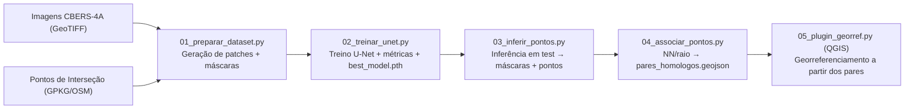

# 🚦 Detecção de Interseções de Rodovias com U-Net (CBERS-4A)

[](https://www.python.org/downloads/)
[](https://pytorch.org/)
[](LICENSE)
[](#)
[](https://qgis.org/)

Pipeline completo para **detecção e georreferenciamento de interseções rodoviárias** a partir de imagens CBERS-4A.  
Usa **U-Net (CNN)** para segmentação binária das interseções, extrai pontos e os **associa** a uma camada de referência (ex.: OSM), permitindo **georreferenciamento no QGIS**.

---

## 🧭 Visão Geral do Pipeline

### 1. Aquisição e Preparo dos Dados

O diagrama abaixo mostra o fluxo de aquisição das imagens CBERS-4A e dos vetores OSM, passando pelo pré-processamento no QGIS até a organização final em pastas.

```mermaid
flowchart LR
    A["Baixar bandas: PAN (2m), RGB e NIR (INPE/CBERS-4A WPM)"] --> B["QGIS: Unir bandas RGB (composição)"]
    B --> C["QGIS: Pan-sharpening usando PAN<br/>(alta resolução + cores)"]
    C --> D["Baixar rodovias (linhas) da região (Geofabrik/OSM)"]
    D --> E["QGIS: Recortar linhas com polígono sobre a imagem"]
    E --> F["Gerar pontos de interseção:<br/>Field Calculator (ID) + Extract Specific Vertices"]
    F --> G["Script Python no QGIS:<br/>agrupar por WKB e manter pontos com ≥ 3 conexões"]
    G --- H["Alternativa: Line Intersection + Join by Attributes + contagem ≥ 3 (remover duplicados)"]
    G --> I["QGIS: Ajustar imagem aos pontos extraídos (georreferenciamento)"]
    I --> J["Ajustes manuais em pontos discrepantes"]
    J --> K["Salvar imagens em input/imagens_tif/"]
    K --> L["Salvar pontos (GPKG) em input/pontos_gpkg/"]
    L --> M["Pronto para rodar: 01_preparar_dataset.py"]
```



### 2. Execução do Pipeline

Depois dos dados preparados, o pipeline segue com os scripts de treinamento, inferência, associação e georreferenciamento, conforme o diagrama abaixo:



---

## 📂 Estrutura do Projeto

```
┌── 01_preparar_dataset.py # Script para preparar o dataset
├── 02_treinar_unet.py # Script de treinamento da U-Net
├── 03_inferir_pontos.py # Script para inferência e geração de pontos
├── 04_associar_pontos.py # Script para associar pontos detectados com OSM
├── 05_plugin_georref.py # Plugin QGIS para georreferenciamento
│
├── components/ # Módulos reutilizáveis
│ ├── dataset.py # Classe RoadIntersectionDataset (carregamento e preparação do dataset)
│ ├── unet.py # Arquitetura da U-Net
│ ├── utils.py # Funções utilitárias (salvar/carregar checkpoints, etc.)
│ ├── losses.py # Funções de perda (BCE, Focal Loss, etc.)
│ └── metrics.py # Métricas de avaliação (IoU, precisão, recall, F1)
│
├── requirements.txt # Dependências do projeto
├── README.md # Este guia/documentação
│
├── checkpoints/ # Pesos salvos durante o treinamento (.pth)
│
├── dataset_separated/ # Dataset final dividido em subconjuntos
│ ├── train/
│ │ ├── images/ # Imagens de treino
│ │ └── masks/ # Máscaras de treino
│ ├── val/
│ │ ├── images/ # Imagens de validação
│ │ └── masks/ # Máscaras de validação
│ ├── test/
│ ├── images/ # Imagens de teste
│ └── masks/ # Máscaras de teste
│
├── dataset_patches/ # Patches gerados a partir das imagens originais
│ ├── images/ # Pedaços (patches) das imagens
│ └── masks/ # Pedaços (patches) das máscaras
│
├── input/ # Pasta para arquivos de entrada para preparo do dataset
│ ├── imagens_tif/ # Imagens de satélite CBERS-4A georreferenciadas
│ └── pontos_gpkg/ # Arquivos .gpkg com pontos de cruzamento devidamente ajustados
│
├── output/ # Resultados sobre teste (máscaras binárias inferidas em GTiff, pontos inferidos e os homólogos em GeoJSON)
│ └── mascaras_patches/ # Imagens das máscaras inferidas
│
├── main_input/ # Pasta para arquivos de entrada para rodar o script principal
│ ├── imagens_tif/ # Imagens de satélite CBERS-4A
│ └── pontos_gpkg/ # Arquivos .gpkg com pontos de cruzamento
│
├── temp_patches/ # Pasta para os arquivos temporários
│
├── main_output/ # Resultados sobre teste (pontos homólogos em GeoJSON para aplicar no georreferenciador do QGIS)
│ └── mascaras_patches/ # Imagens das máscaras inferidas
│
└── README.md
```

---

## ⚙️ Instalação

Crie um ambiente e instale dependências:

```bash
python -m venv .venv
# Windows PowerShell
.venv\Scripts\Activate.ps1
# Linux/Mac
# source .venv/bin/activate

pip install -r requirements.txt
```

> GPU (exemplo CUDA 12.1):
```bash
pip install torch==2.8.0 torchvision==0.23.0 --index-url https://download.pytorch.org/whl/cu121
```

---

## 🗂️ Aquisição e Preparo dos Dados

Antes de iniciar o pipeline (🚀 Como Usar), é necessário preparar o **dataset** que servirá de base para o treinamento e validação da rede.

### 🔹 Imagens de Satélite (CBERS-4A — Câmera WPM)
- As imagens foram obtidas no **site do INPE**, câmera **WPM**, que fornece:
  - Banda PAN (panchromática) — resolução espacial de 2 m  
  - Bandas espectrais RGB + NIR — em arquivos separados  
- Com o **QGIS**:
  1. **Unimos as bandas RGB** em uma única composição colorida.  
  2. Fizemos o **pan-sharpening** usando a banda PAN para aumentar a resolução espacial, obtendo assim uma imagem de **alta resolução colorida**.  

### 🔹 Vetores de Rodovias (OpenStreetMap)
- Obtidos no site **Geofabrik**, recortes do OSM das regiões do Brasil.  
- No QGIS:
  1. Fizemos um **recorte dos vetores** (linhas) usando um polígono temporário desenhado sobre a imagem CBERS-4A — garantindo que apenas rodovias dentro da área da imagem fossem mantidas.  
  2. Esse recorte reduz a complexidade e **facilita o geoprocessamento**.  

### 🔹 Conversão de Linhas em Pontos de Interseção
Para identificar os **cruzamentos rodoviários**:

1. No QGIS:  
   - Usar o **Field Calculator** e criar um campo `id` para cada feição (linha).  
   - Executar **Extract Specific Vertices** com parâmetros `1,-1` para obter pontos iniciais e finais de cada linha.  

2. No Python (QGIS Python Console ou script), rodar:

   ```python
   from collections import defaultdict

   endPointDict = defaultdict(set)
   for feat in pointLayer.getFeatures():
       geom = feat.geometry()
       geomWkb = geom.asWkb()
       endPointDict[geomWkb].add(feat["featid"])

   outputPointList = []
   for geomKey, idSet in endPointDict.items():
       if len(idSet) < 3:  # cruzamento detectado
           continue
       newGeom = QgsGeometry()
       newGeom.fromWkb(geomKey)
       outputPointList.append(newGeom)
   ```

   Esse código **mantém apenas os pontos onde há 3 ou mais conexões de linhas**, ou seja, os **cruzamentos rodoviários reais**.  

3. Caso queira usar **Line Intersection** no QGIS para encontrar interseções:
   - Adicionar um campo `id` via Field Calculator.  
   - Usar **Join by Attributes**.  
   - Contar quantos registros cada ponto possui.  
   - Filtrar apenas pontos com **3 ou mais ocorrências**, eliminando duplicados.  

### 🔹 Georreferenciamento Final
- Usando o **QGIS**, ajustar o georreferenciamento para alinhar a imagem CBERS-4A aos pontos extraídos:  
  - Ajustar a imagem para que os cruzamentos estejam o mais próximo possível dos pontos gerados.  
  - **Mover manualmente** pontos em locais de maior discrepância.  

Com isso, temos:
- Imagens CBERS-4A georreferenciadas e preparadas.  
- Camada de pontos representando cruzamentos rodoviários.  

---

## 📁 Organização Final dos Dados

Os arquivos devem ser organizados assim:

```
input/
├── imagens_tif/      # Imagens de satélite CBERS-4A georreferenciadas
└── pontos_gpkg/      # Camadas .gpkg com pontos de cruzamento
```

Essas pastas serão utilizadas diretamente no script **01_preparar_dataset.py** para geração dos patches de treino, validação e teste.

---

## 🚀 Como Usar

Aqui está o fluxo completo do pipeline, com a explicação detalhada de cada script:

### 1) Preparar dataset — `01_preparar_dataset.py`
```bash
python 01_preparar_dataset.py
```
Este script:
- Lê as **imagens CBERS-4A georreferenciadas** (GeoTIFF) da pasta `input/imagens_tif/`.  
- Lê os **pontos de cruzamento** (GPKG) da pasta `input/pontos_gpkg/`.  
- Converte os pontos para o mesmo sistema de coordenadas da imagem.  
- Gera **máscaras binárias** (cruzamentos em branco sobre fundo preto).  
- Corta imagens e máscaras em **patches** (`dataset_patches/`).  
- Separa em **treino / validação / teste** dentro de `dataset/`.

---

### 2) Treinar a U-Net — `02_treinar_unet.py`
```bash
python 02_treinar_unet.py
```
Este script:
- Carrega os patches de `dataset/train/` e `dataset/val/`.  
- Treina a rede **U-Net** com função de perda *FocalLoss*.  
- Avalia métricas (IoU, precisão, recall, F1) a cada época.  
- Salva checkpoints (`checkpoints/checkpoint_epoch_X.pth`).  
- Salva também o melhor modelo em `checkpoints/best_model.pth`.  
- Pode registrar o treinamento no **TensorBoard**:
  ```bash
  tensorboard --logdir runs/
  ```

---

### 3) Inferir pontos — `03_inferir_pontos.py`
```bash
python 03_inferir_pontos.py
```
Este script:
- Usa o modelo salvo em `checkpoints/best_model.pth`.  
- Roda a inferência nos patches de `dataset/test/images/`.  
- Gera **máscaras preditas** por patch em `resultados/mascaras_patches/`.  
- Extrai **pontos georreferenciados** dos blobs detectados.  
- Exporta para `resultados/pontos_detectados.geojson`.  

---

### 4) Associar pontos com referência — `04_associar_pontos.py`
```bash
python 04_associar_pontos.py
```
Este script:
- Carrega `resultados/pontos_detectados.geojson` (pontos inferidos).  
- Carrega os pontos de referência (ex.: OSM).  
- Faz associação usando **Nearest Neighbors** com limite de distância.  
- Produz `resultados/pares_homologos.geojson`, contendo os pares **(ponto detectado ↔ ponto de referência)**.  

---

### 5) Georreferenciar no QGIS — `05_plugin_georref.py`
Este script é usado como **plugin dentro do QGIS**. Ele:
- Divide uma imagem alvo em patches nos locais de interesse.  
- Roda a U-Net para detectar interseções nessa nova imagem.  
- Extrai os pontos detectados.  
- Associa automaticamente aos pontos de referência fornecidos.  
- Gera os pares necessários para o **georreferenciamento da imagem no QGIS**.  

No QGIS, após rodar, é possível ajustar manualmente alguns pontos se necessário.

---

## 🧑‍💻 Exemplo de Código (usando `components/`)

```python
import torch
from torch.utils.data import DataLoader

from components.dataset import RoadIntersectionDataset
from components.unet import UNet
from components.losses import FocalLoss
from components.utils import save_model
from components.metrics import calculate_metrics

# Dataset + DataLoader
train_ds = RoadIntersectionDataset("dataset/train/images", "dataset/train/masks")
train_loader = DataLoader(train_ds, batch_size=4, shuffle=True)

# Modelo + Loss + Otimizador
model = UNet(n_channels=3, n_classes=1)
criterion = FocalLoss()
optimizer = torch.optim.Adam(model.parameters(), lr=1e-4)

# Treino simples (exemplo)
for epoch in range(2):
    for images, masks in train_loader:
        optimizer.zero_grad()
        outputs = model(images)
        loss = criterion(outputs, masks)
        loss.backward()
        optimizer.step()
    print(f"Epoch {epoch+1} | Loss: {loss.item():.4f}")

# Salvar checkpoint
save_model(model, optimizer, epoch=2, path="checkpoints/example_model.pth")

# Métricas
metrics = calculate_metrics(outputs, masks)
print(metrics)
```

---

## 📊 Saídas Principais

- `resultados/pontos_detectados.geojson` — pontos inferidos  
- `resultados/pares_homologos.geojson` — pares para georref  
- `resultados/mascaras_patches/` — máscaras por patch

---

## 🛠️ Dicas Rápidas

- **Buffer:** ajuste `buffer_pixels` para calibrar a máscara de treino.  
- **Threshold:** usar o melhor `threshold` validado melhora extração de blobs.

---

## 👤 Autores

Este projeto foi desenvolvido de forma colaborativa por:

- **Jaime Guilherme Loureiro Breda**  
- **Isaac Uchôa Lima**  
- **Leonardo Seiichi Kudo**  

Cada um contribuiu para diferentes etapas do pipeline, unindo esforços na preparação do dataset, no desenvolvimento da rede e no geoprocessamento.
